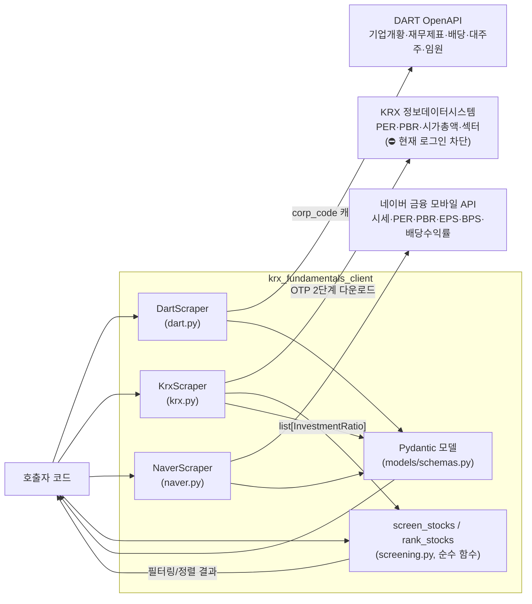

# krx-fundamentals-client

[](https://github.com/younghwan91/krx-fundamentals-client/actions/workflows/ci.yml)
[](https://www.python.org/downloads/)
[](https://github.com/younghwan91/krx-fundamentals-client/blob/main/LICENSE)
[](https://www.linkedin.com/in/younghwan-chae/)

[English](README.en.md)

**DART·KRX·네이버 금융에서 국내 기업 펀더멘탈을 모아 하나의 스키마로 내주는 Python 클라이언트 라이브러리** — 재무제표, 투자지표, 배당, 대주주, 임원, 종목 스크리닝.

[kiwoom-client](https://github.com/younghwan91/kiwoom-client), [krx-news-client](https://github.com/younghwan91/krx-news-client)와 같은 성격의 라이브러리다 — 서버 없이, 호출할 때마다 소스에 직접 요청해 결과를 돌려준다.

> ⛔ **KRX 수집 경로는 현재 막혀 있다 (2026-08 실측).** KRX 로그인 문제로 투자지표·시가총액·섹터가
> 조용히 빈 채로 온다 (상위 100종목은 `NaverScraper`로 대체 가능, DART 경로는 영향 없음).
> 원인 코드 추적은 [docs/krx-blocked.md](docs/krx-blocked.md).

## 설치

```bash
pip install krx-fundamentals-client
```

## 빠른 시작

```python
import asyncio
from krx_fundamentals_client import DartScraper

async def main():
    scraper = DartScraper(api_key="...")  # https://opendart.fss.or.kr 무료 발급
    try:
        company = await scraper.fetch_company("005930")
        print(company.name, company.ceo)

        financials = await scraper.fetch_financials("005930", year=2025)
        print(financials.revenue, financials.operating_income)
    finally:
        await scraper.close()

asyncio.run(main())
```

시장 전체 투자지표와 랭킹/스크리닝:

```python
from krx_fundamentals_client import KrxScraper, Market, RankingMetric, rank_stocks, screen_stocks

async def screen():
    scraper = KrxScraper()
    try:
        ratios = await scraper.fetch_investment_ratios(Market.KOSPI)
    finally:
        await scraper.close()

    value_stocks = screen_stocks(ratios, per_max=10, pbr_max=1.0)
    top_by_roe = rank_stocks(ratios, RankingMetric.ROE)
```

배치 조회·키 순환 같은 실전 패턴은 아래 [고급 사용법](#고급-사용법)에, 바로 돌려볼 수 있는
전체 스크립트는 [`examples/`](examples/)에 있다.

## 데이터 소스

| 소스 | 데이터 | 수집 단위 | 인증 |
|-----|-------|----------|------|
| [DART OpenAPI](https://opendart.fss.or.kr) | 기업개황, 재무제표, 배당, 대주주, 임원 | 종목 단위 (재무제표는 최대 100종목/호출 배치도 가능) | API 키 (무료) |
| [KRX 정보데이터시스템](http://data.krx.co.kr) | PER, PBR, 시가총액, 섹터 | 시장 전체 벌크 CSV | 불필요 (⛔ 현재 로그인 차단) |
| [네이버 금융](https://m.stock.naver.com) | 시세·PER·PBR·EPS·BPS·배당수익률 | 종목 단위 | 불필요 |

## 응답 모델

`Company`, `FinancialStatement`, `InvestmentRatio`, `Dividend`, `Shareholder`, `Executive`, `SectorOverview` — 전부 Pydantic 모델이며 `krx_fundamentals_client`에서 바로 import 할 수 있다. 필드는 [`models/schemas.py`](src/krx_fundamentals_client/models/schemas.py) 참고.

## 스크리닝 / 랭킹

`screen_stocks`, `rank_stocks`는 캐시나 상태를 갖지 않는 순수 함수다 — `KrxScraper.fetch_investment_ratios()`로 받은 `list[InvestmentRatio]`를 넘기면 그 자리에서 필터링/정렬해 반환한다.

## 고급 사용법

여러 종목의 재무제표를 한 번에 (DART `fnlttMultiAcnt` 배치, 최대 100종목/호출):

```python
financials = await scraper.fetch_financials_batch(
    ["005930", "000660", "035420"], year=2025,
)
for ticker, fs in financials.items():
    if fs is not None:
        print(ticker, fs.revenue, fs.net_income)
```

DART 키의 일일 한도를 소진하면 `DartScraper`가 `DartQuotaExceededError`를 던진다 — 여러 키를 순환할 때 잡아서 다음 키로 넘어가면 된다:

```python
from krx_fundamentals_client import DartQuotaExceededError, DartScraper

async def fetch_with_rotation(tickers, keys):
    for key in keys:
        scraper = DartScraper(api_key=key)
        try:
            return [await scraper.fetch_company(t) for t in tickers]
        except DartQuotaExceededError:
            continue
        finally:
            await scraper.close()
    raise RuntimeError("모든 키가 일한도를 소진했다")
```

## 아키텍처



## 개발

```bash
uv sync --extra dev
uv run pytest                        # 테스트
uv run ruff check src/ tests/        # 린트
uv run ruff format src/ tests/       # 포맷
```

## 문서

- [docs/architecture.md](docs/architecture.md) — 스크레이퍼 구조, 랭킹/스크리닝, DART 호출 순서
- [docs/krx-blocked.md](docs/krx-blocked.md) — KRX 차단 코드 추적
- [`examples/`](examples/) — 바로 돌려볼 수 있는 사용 예제

## 라이선스

Apache-2.0 ([LICENSE](LICENSE))

## 만든 사람

**채영환 (Younghwan Chae)** · [GitHub @younghwan91](https://github.com/younghwan91) · [LinkedIn](https://www.linkedin.com/in/younghwan-chae/)

버그와 질문은 [Issues](https://github.com/younghwan91/krx-fundamentals-client/issues) 로,
쓸 만했다면 ⭐ 하나 눌러주면 힘이 된다.

## 관련 프로젝트

같은 오픈소스 퀀트 스택의 다른 저장소들 — 각각 독립적으로 쓸 수 있다.

| 프로젝트 | 설명 |
|---|---|
| 🇰🇷 [kiwoom-client](https://github.com/younghwan91/kiwoom-client) | 키움증권 REST API 라이브러리 |
| 🇰🇷 [krx-news-client](https://github.com/younghwan91/krx-news-client) | 한국 주식 뉴스·공시 수집 클라이언트 |
| 🇰🇷 [fin-checkup](https://github.com/younghwan91/fin-checkup) | 관심종목 위험 공시 텔레그램 알림 |
| 🇰🇷 [quant-airflow](https://github.com/younghwan91/quant-airflow) | 시세·수급·실적 Airflow 수집 파이프라인 |
| 🇰🇷 [kr-quant](https://github.com/younghwan91/kr-quant) | 코스피·코스닥 알파 리서치 |
| 🇺🇸 [portfolio-research](https://github.com/younghwan91/portfolio-research) | 미국주식 팩터 엔진 + ETF 전술배분 |
| 🇺🇸 [automated-stock-trading-systems](https://github.com/younghwan91/automated-stock-trading-systems) | 비상관 트레이딩 시스템 백테스터 |
| ₿ [quantbox-engine](https://github.com/younghwan91/quantbox-engine) | 암호화폐 선물 백테스트·실행 엔진 |

