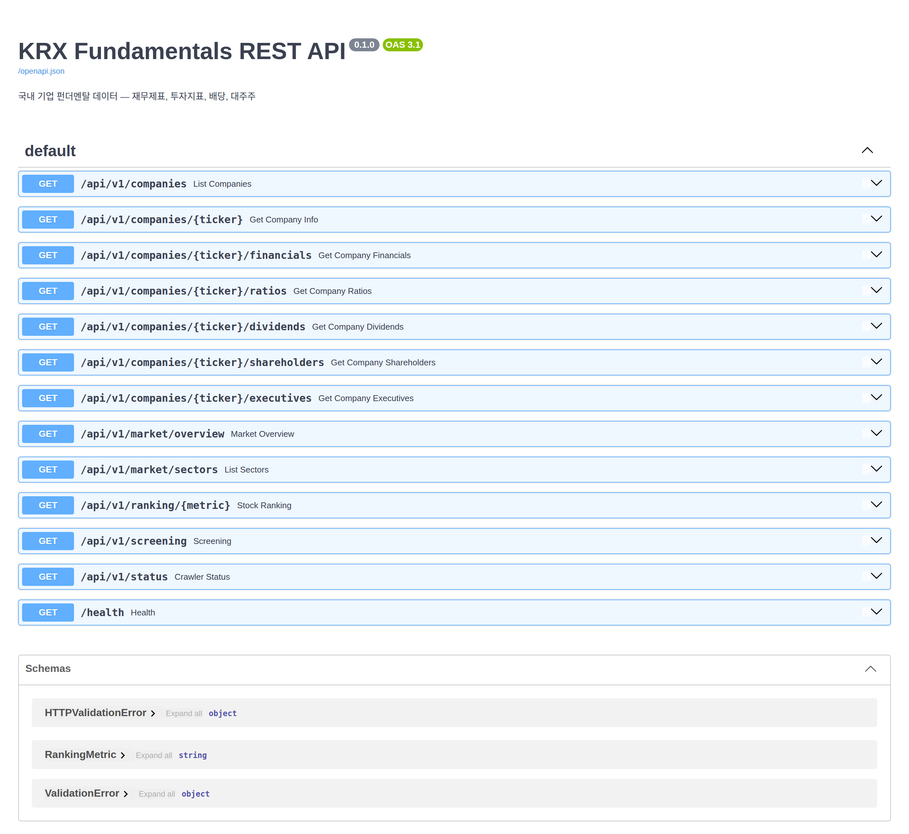

# 📊 KRX Fundamentals REST API

> 국내 기업 펀더멘탈 데이터를 수집·제공하는 REST API — 재무제표, 투자지표, 배당, 스크리닝

[](https://github.com/younghwan91/krx-fundamentals-api/actions/workflows/ci.yml)
[](https://www.python.org/downloads/)
[](https://fastapi.tiangolo.com/)
[](https://github.com/younghwan91/krx-fundamentals-api/blob/main/LICENSE)
[](https://www.linkedin.com/in/younghwan-chae/)



DART·KRX·네이버 금융에서 기업 펀더멘탈을 모아 정규화한 뒤 REST API 로 내준다.

## 왜 캐시 우선인가

외부 소스는 느리고, 자주 막히고, 요청 한도가 있다. 그래서 수집과 응답을 분리했다 —
백그라운드 스케줄러(APScheduler)가 주기적으로 긁어 Redis 에 넣고, API 는 Redis 만 읽는다.
요청이 외부 사이트를 건드리지 않으므로 응답이 일정하고, 소스가 죽어도 마지막 스냅샷은 서빙된다.

> ⛔ **KRX 수집 경로는 현재 막혀 있다 (2026-08 실측).**
> KRX 가 MDCSTAT 계열에 로그인을 걸면서 OTP 발급이 토큰 대신 `LOGOUT` 을 돌려주는데,
> 스크레이퍼가 이를 정상 OTP 로 보고 넘겨 **예외 없이 0건을 수집한다**.
> 그 결과 KRX 가 채우는 투자지표·시가총액·섹터가 조용히 비고, `/ranking`·`/screening`·`/market/sectors` 도 함께 빈다
> (상위 100종목은 네이버 보조 수집이 메운다. DART 경로는 영향 없음).
> 코드 추적은 [docs/krx-blocked.md](docs/krx-blocked.md).

## 빠른 시작

```bash
git clone https://github.com/younghwan91/krx-fundamentals-api.git
cd krx-fundamentals-api

cp .env.example .env    # DART_API_KEY 입력 (필수, https://opendart.fss.or.kr 무료 발급)
docker compose up -d    # API + Redis

curl http://localhost:8010/health   # {"status":"ok"}
open http://localhost:8010/docs     # Swagger UI
```

로컬 개발 실행, 환경변수, 테스트·린트는 [docs/architecture.md](docs/architecture.md) 참고.

## 엔드포인트

| 메서드 | 엔드포인트 | 설명 |
|-------|-----------|------|
| `GET` | `/api/v1/companies` | 기업 목록 (검색·페이지네이션) |
| `GET` | `/api/v1/companies/{ticker}` | 기업 상세 |
| `GET` | `/api/v1/companies/{ticker}/financials` | 재무제표 — DART 사업보고서 연간 3개 연도 |
| `GET` | `/api/v1/companies/{ticker}/ratios` | 투자지표 스냅샷 (PER·PBR·EPS·BPS·배당수익률) |
| `GET` | `/api/v1/companies/{ticker}/dividends` | 배당 이력 |
| `GET` | `/api/v1/companies/{ticker}/shareholders` | 대주주 — ⚠️ 수집 잡이 스케줄러에 없어 **항상 빈 목록** |
| `GET` | `/api/v1/companies/{ticker}/executives` | 임원 — ⚠️ 위와 같은 이유로 **항상 빈 목록** |
| `GET` | `/api/v1/market/overview` | 섹터 목록 + 수집기 상태 |
| `GET` | `/api/v1/market/sectors` | 섹터별 통계 — ⚠️ KRX 차단으로 현재 빈 목록 |
| `GET` | `/api/v1/ranking/{metric}` | 지표별 랭킹 |
| `GET` | `/api/v1/screening` | 복합 조건 스크리닝 |
| `GET` | `/api/v1/status` | 수집 상태 (소스 × 잡) |
| `GET` | `/health` | 헬스체크 |

전체 요청/응답 예시와 스크리닝 파라미터는 **[docs/api-examples.md](docs/api-examples.md)** 에 있다.
바로 돌려볼 수 있는 클라이언트 예제는 [`examples/`](examples/) 에 있다.

## 데이터 소스

| 소스 | 데이터 | 주기 | 인증 |
|-----|-------|------|------|
| [DART OpenAPI](https://opendart.fss.or.kr) | 기업개황, 재무제표, 배당 | 24시간 | API 키 (필수) |
| [KRX 정보데이터시스템](http://data.krx.co.kr) | PER, PBR, 시가총액, 섹터 | 1시간 | ⛔ 로그인 필요 — 현재 수집 불가 |
| [네이버 금융](https://m.stock.naver.com) | 시세·PER·PBR·EPS·BPS·배당수익률 (**상위 100종목만**) | 1시간 | 불필요 |

DART 키가 없으면 기업 목록 자체가 비고, 네이버 보조 수집도 대상 종목을 찾지 못한다.

## 기술 스택

FastAPI · httpx(async) · Redis · APScheduler · Pydantic · BeautifulSoup4 · Ruff · pytest + fakeredis · Docker

## 라이선스

Apache-2.0 ([LICENSE](LICENSE))

## ⭐ 도움이 되셨다면

우측 상단 **[⭐ Star](https://github.com/younghwan91/krx-fundamentals-api)** 를 눌러주세요.

- 🐛 버그·질문 → [Issues](https://github.com/younghwan91/krx-fundamentals-api/issues)
- 📈 업데이트 소식 → [팔로우 @younghwan91](https://github.com/younghwan91)

## 관련 프로젝트 — 오픈소스 퀀트 스택

한국·미국 주식과 암호화폐를 아우르는 오픈소스 스택입니다. 각 저장소는 독립적으로 쓸 수 있습니다.

| 축 | 프로젝트 | 설명 |
|---|---|---|
| 🇰🇷 한국 주식 | **[kiwoom-rest-api](https://github.com/younghwan91/kiwoom-rest-api)** | 키움증권 REST API Python 라이브러리 — 국내주식 엔드포인트 전수·실시간 WebSocket, sync + async (`pip install kiwoom-client`) |
| 🇰🇷 한국 주식 | **[krx-news-rest-api](https://github.com/younghwan91/krx-news-rest-api)** | 한국 주식 뉴스·공시 수집 REST API (FastAPI + Redis) |
| 🇰🇷 한국 주식 | **[quant-airflow](https://github.com/younghwan91/quant-airflow)** | 시세·수급·실적을 TimescaleDB 로 수집하는 Airflow 파이프라인 — 상장폐지 종목까지 담아 생존편향을 막는다 |
| 🇰🇷 한국 주식 | **[kr-quant](https://github.com/younghwan91/kr-quant)** | 코스피·코스닥 알파 리서치 — walk-forward·랜덤 음성대조·purged CV·Deflated Sharpe 를 CI 가드레일로 강제 |
| 🇺🇸 미국 주식 | **[opt_portfolio](https://github.com/younghwan91/opt_portfolio)** | 미국주식 팩터 엔진 — point-in-time·생존편향 보정 데이터 위에서 walk-forward 를 Deflated Sharpe 로 게이팅 (+ VAA 자산배분 백테스터) |
| 🇺🇸 미국 주식 | **[automated-stock-trading-systems](https://github.com/younghwan91/automated-stock-trading-systems)** | Bensdorp 의 7개 비상관 트레이딩 시스템 백테스터 (교육용 재구현) |
| ₿ 암호화폐 | **[quantbox-engine](https://github.com/younghwan91/quantbox-engine)** | 암호화폐 선물 백테스트·실행 엔진 — 룩어헤드 0, 백테스트↔실거래 일체화 |

## 만든 사람

**채영환 (Younghwan Chae)** · [GitHub @younghwan91](https://github.com/younghwan91) · [LinkedIn](https://www.linkedin.com/in/younghwan-chae/)

전체 오픈소스 퀀트 스택은 [프로필](https://github.com/younghwan91)에서 한눈에 볼 수 있습니다.
